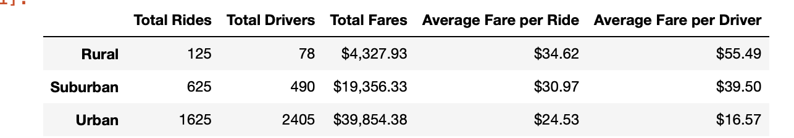
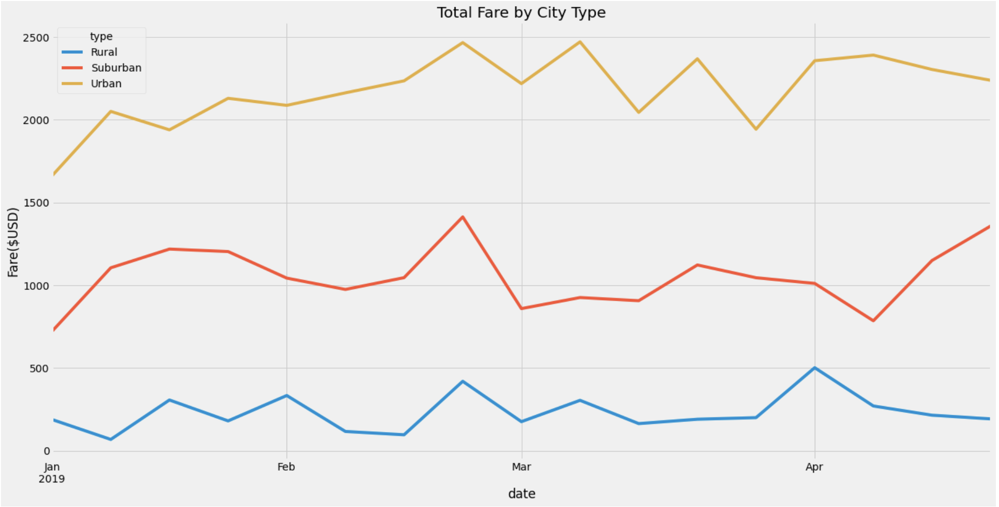

# PyBer_Analysis

## Overview of the analysis
Using Python skills and knowledge of Pandas, create a summary DataFrame of the ride-sharing data by city type and with MatPlotLib create multiple-line graph that shows the total weekly fares for each city type.

## Resources
Jupyter Notebook
Python 3.7.10

### Dependencies:
  - Python Pandas library
  - Python Numpy library
  - Python MatPlotLib library

## Requirements
Generate a summary DataFrame of the city-level ride-sharing data.
Create a graph showing the average weekly fares for each type of city, using Pandas and Matplotlib.
Report that explains how the data differs depending on city type and how PyBer can use those differences to inform decision-making.

## Results
According to the analysis:
  - The Urban area have higher number of rides but Average Fare per ride is less than Rural area. 
  - The Urban cities, the total fares are higher than Rural and Suburban cities. 
  - In Urban cities the Average Fare per driver is less as compared to Rural cities.
 

Multiple line chart:
  - From January 2019 to April 2019, we can obtain information on "Total fare by city type" on a weekly basis.
  - Ride-sharing companies have more total fares and profits in urban areas than in suburban and rural areas.
  - According to this chart, urban cities have reached their maximum fare of $ 2500 in February itself, but for rural areas the maximum fare reached $500 in April.
  

## Summary
According to the data, drivers in rural areas tend to earn nearly four times as much as their urban counterparts. As a result, PyBer ride sharing customers may not have enough drivers. A promotion or hiring event might be very helpful in making the service more accessible.

On the other hand, In urban areas there are an excessive large number of drivers. In fact, the number of drivers outnumbers the number of riders. PyBers best interests may be served by attempting to market their product to more potential urban clients in order to boost rides.

